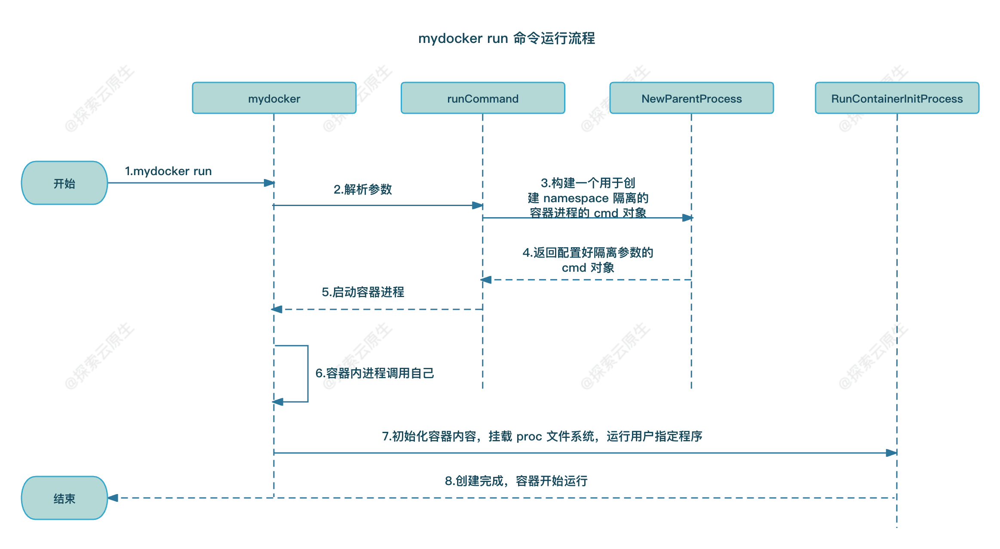
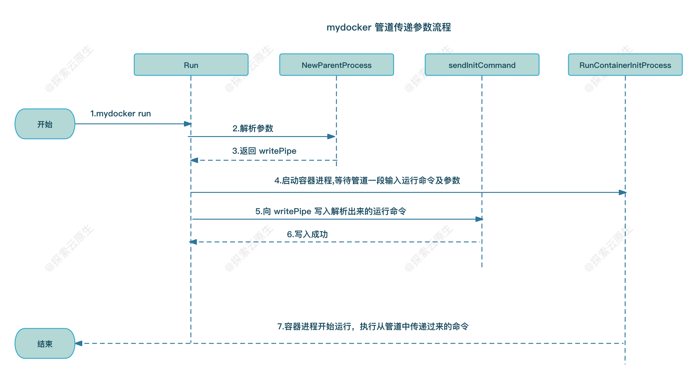
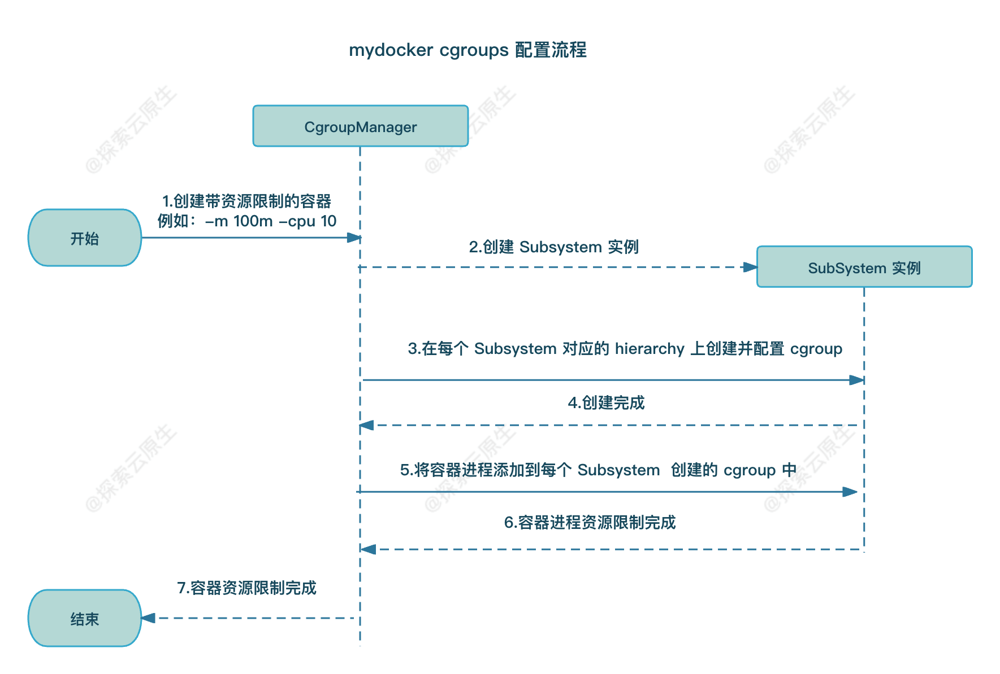

# 第三章 构造容器

开发中使用到的第三方包：

```shell
go get github.com/urfave/cli
go get github.com/sirupsen/logrus
```

## Linux proc 文件系统

​`/proc` ​文件系统由内核提供，包含系统运行时的信息，只存在与内存中。

## 实现 run 命令

​`syscall.Exec` ​是最为重要的一句黑魔法，正是这个系统调用实现了完成初始化动作并将用户进程运行起来的操作。

首先，使用 Docker 创建起来一个容器之后，会发现容器内的第一个程序，也就是 PID 为 1 的那个进程，是指定的前台进程。但是，我们知道容器创建之后，执行的第一个进程并不是用户的进程，而是 init 初始化的进程。 这时候，如果通过 ps 命令查看就会发现，容器内第一个进程变成了自己的 init,这和预想的是不一样的。

**有没有什么办法把自己的进程变成 PID 为 1 的进程呢？**

这里 execve 系统调用就是用来做这件事情的。

syscall.Exec 这个方法，其实最终调用了 Kernel 的 `int execve(const char *filename, char *const argv[], char *const envp[]);` ​这个系统函数。**它的作用是执行当前 filename 对应的程序,它会覆盖当前进程的镜像、数据和堆栈等信息，包括 PID，这些都会被将要运行的进程覆盖掉**。

也就是说，调用这个方法，将用户指定的进程运行起来，把最初的 init 进程给替换掉，这样当进入到容器内部的时候，就会发现容器内的第一个程序就是我们指定的进程了。

> 这其实也是目前 Docker 使用的容器引擎 runC 的实现方式之一。

```shell
➜  my-docker git:(ch3) ✗ go build .   
➜  my-docker git:(ch3) ✗ ls
README.md  container  docs  go.mod  go.sum  main.go  main_command.go  mydocker  run.go  test
➜  my-docker git:(ch3) ✗ sudo ./mydocker run -it /bin/sh
[sudo] password for pjm: 
{"level":"info","msg":"[initCommand] init comeon","time":"2024-02-16T22:11:03+08:00"}
{"level":"info","msg":"[initCommand] init command /bin/sh","time":"2024-02-16T22:11:03+08:00"}
{"level":"info","msg":"command /bin/sh","time":"2024-02-16T22:11:03+08:00"}
# ps -ef
UID        PID  PPID  C STIME TTY          TIME CMD
root         1     0  0 22:11 pts/6    00:00:00 /bin/sh
root         6     1  0 22:11 pts/6    00:00:00 ps -ef
# ls
README.md  container  docs  go.mod  go.sum  main.go  main_command.go  mydocker  run.go  test
```

> 由于没有 chroot ，所以目前的系统文件系统是继承自父进程的。

### 小结

*  **/proc/self/exe**：调用自身 init 命令，初始化容器环境

​`/proc/self/exe`​ 是 Linux 系统中的一个符号链接，**它指向当前进程的可执行文件**。

这个路径是一个虚拟路径，实际上并不对应于文件系统中的一个文件，而是通过 /proc 文件系统提供的一种方式来访问进程相关的信息。

具体而言，/proc/self 是一个指向当前进程自身的符号链接，而 exe 则是一个特殊的文件，通过这个文件可以访问当前进程的可执行文件。

**因此，/proc/self/exe 实际上是当前进程可执行文件的路径**。

也就是说在 mydocker run 命令中执行的 /proc/self/exe init 实际上最终执行的是 mydocker init，即 run 命令会调用 init 命令来初始化容器环境。

* **tty**：实现交互

当用户指定 -it 参数时，就将 cmd 的输入和输出连接到终端，以便我们可以与命令进行交互，并看到命令的输出。

* **Namespace 隔离**：通过在 fork 时指定对应 Cloneflags 来实现创建新 Namespace

fork 新进程时，通过指定 Cloneflags 会创建对应的 Namespace 以实现隔离，这里包括 UTS（主机名）、PID（进程 ID）、挂载点、网络、IPC 等方面的隔离。

* **proc 隔离**：通过重新 mount /proc 文件系统来实现进程信息隔离

/proc 文件系统是一个虚拟的文件系统，提供了对内核和运行中进程的信息的访问。通过挂载 /proc，系统中的许多信息和控制接口可以通过文件的形式在这个目录下找到。

> 例如，你可以通过 /proc 查看系统的一些信息，如进程列表、内存使用情况、CPU 信息等。

例如:

```shell
➜  ~ ls /proc
1      36011  83329      bus        diskstats    ioports      kpagecount  mounts        stat         version
144    4      83330      cgroups    dma          irq          kpageflags  mtrr          swaps        vmallocinfo
145    54     83331      cmdline    driver       kallsyms     loadavg     net           sys          vmstat
160    55     94546      config.gz  execdomains  kcore        locks       pagetypeinfo  sysvipc      zoneinfo
161    56     94547      consoles   filesystems  key-users    mdstat      partitions    thread-self
35427  76282  94548      cpuinfo    fs           keys         meminfo     schedstat     timer_list
35428  76283  acpi       crypto     interrupts   kmsg         misc        self          tty
35429  76284  buddyinfo  devices    iomem        kpagecgroup  modules     softirqs      uptime
➜  ~
```

而在容器环境中，为了和宿主机的 /proc 环境隔离，因此在 `mydocker init`​ 命令中我们会重新挂载 /proc 文件系统，即：

```go
defaultMountFlags := syscall.MS_NOEXEC | syscall.MS_NOSUID | syscall.MS_NODEV
_ = syscall.Mount("proc", "/proc", "proc", uintptr(defaultMountFlags), "")
```

对应的 mount 命令为: `mount -t proc proc /proc`​

而当前进程在 fork 时指定了 `syscall.CLONE_NEWPID`​ 等等标记，因此是在新的 Namespace 中的，那就意味着看不到宿主机上的进程信息，那么重新挂载后的 /proc 文件系统自然也就只有当前 Namespace 下的进程信息。

> 这也就是为什么在容器中执行 ps 命令只能看到容器中的进程信息

* **execve 系统调用**：使用指定进程覆盖 init 进程

**execve 系统调用用于取代当前进程的映像（即，当前进程的可执行文件），并用一个新的程序来替代**。

原型如下：

```
int execve(const char *filename, char *const argv[], char *const envp[);
```

* ​`filename`​ 参数指定了要执行的新程序的文件路径。
* ​`argv`​ 参数是一个字符串数组，包含了新程序的命令行参数。数组的第一个元素通常是新程序的名称，随后的元素是命令行参数。
* ​`envp`​ 参数是一个字符串数组，包含了新程序执行时使用的环境变量。

execve 的工作方式是加载指定的程序文件，并将它替代当前进程的内存映像。因此，执行 execve 后，原进程的代码、数据等内容都会被新程序的内容替代。

> 即：它的作用是执行当前 filename 对应的程序,它会覆盖当前进程的镜像、数据和堆栈等信息，包括 PID，这些都会被将要运行的进程覆盖掉。

在 Go 中的调用方式为 `syscall.Exe`​。 通过该系统调用，可以使用用户指定的命令启动新进程来覆盖 mydocker 进程作为容器环境中的 PID 1 进程。

> 即：在 init 命令中解析拿到用户指定的命令并通过 `syscall.Exe`​ 使用该命令创建新进程来覆盖 mydocker 进程。
>
> 这也就是为什么我们执行 `mydocker run -it /bin/sh`​ 后 sh 会成为 PID 1 进程。

### 运行流程

​​

* 1）流程开始，用户手动执行 mydocker run 命令
* 2）urfave/cli 工具解析传递过来的参数
* 3）解析完成后发现第一个参数是 run，于是执行 run 命令，调用 runCommand 方法，该方法中继续调用 NewParentProcess 函数构建一个 cmd 对象
* 4）NewParentProcess 将构建好的 cmd 对象返回给 runCommand 方法
* 5）runCommand 方法中调用 cmd.exec 执行上一步构建好的 cmd 对象
* 6）容器启动后，根据 cmd 中传递的参数，/proc/self/exe init 实则最终会执行 mydocker init 命令，初始化容器环境
* 7）init 命令内部实现就是通过 mount 命令挂载 proc 文件系统
* 8）容器创建完成，整个流程结束

## 优化: 使用匿名管道传递参数

### 存在的问题

**如果用户输入参数特别长，或者里面有一些特殊字符时该方案就会失效**。

### 什么是匿名管道

**匿名管道是一种特殊的文件描述符，用于在父进程和子进程之间创建通信通道**。

有以下特点：

* 管道有一个固定大小的缓冲区，一般是4KB。
* 这种通道是单向的，即数据只能在一个方向上流动。
* 当管道被写满时，写进程就会被阻塞，直到有读进程把管道的内容读出来。
* 同样地，当读进程从管道内拿数据的时候，如果这时管道的内容是空的，那么读进程同样会被阻塞，一直等到有写进程向管道内写数据。

因此，匿名管道在进程间通信中很有用，可以使一个进程的输出成为另一个进程的输入，从而实现进程之间的数据传递。

**为什么选择匿名管道？**

我们这个场景正好也是父进程和子进程之间传递数据，而且也是单向的，只会从父进程传递给子进程，因此正好使用匿名管道来实现。

返回的两个 FD 一个代表管道的读端，另一个代表写端。

我们只需要把 readPipe FD 告知子进程，writePipe FD 告知父进程即可完成通讯。父进程将参数写入到 writePipe 后，子进程即可从 readPipe 中读取到。

### 具体实现

整个实现分为两个部分：

#### FD 传递

首先在父进程里创建一个匿名管道,父进程就可以拿到writepipe的fd.

现在需要将readpipe fd告知子进程,**将 readPipe 作为 ExtraFiles，这样 cmd 执行时就会外带着这个文件句柄去创建子进程**。

#### 数据读写

##### 父进程写数据

由于父进程天然就能拿到 writePipe FD，因此只需要在合适的时候将数据写入管道即可。

**何为合适的时候？**

虽然匿名管道自带 4K 缓冲，但是如果写满之后就会阻塞，因此最好是等子进程启动后，再往里面写，尽量避免意外情况。

因此，**合适的时候就是指子进程启动之后**。

> 如果未启动子进程就往管道中写，写完了再启动子进程，大部分情况下也可以，但是如果 cmd 大于 4k 就会导致永久阻塞。
>
> 因为子进程未启动，管道中的数据永远不会被读取，因此会一直阻塞。

对应到代码中，也就是 `parent.Start()`​ 之后，等子进程启动后就通过 writePipe FD 将命令写入到管道中。

##### 子进程读数据

子进程这边就麻烦一点，包含以下两步：

* 1）获取 readPipe FD
* 2）读取数据

子进程启动后，首先要找到前面通过`ExtraFiles`​ 传递过来的 readPipe FD，然后才是数据读取，

子进程 fork 出来后，执行到`readUserCommand`​函数就会开始读取参数，此时如果父进程还没有开始发送参数，根据管道的特性，子进程会阻塞在这里，一直到父进程发送数据过来后子进程才继续执行下去。

​​

* 父进程创建匿名管道，得到 readPiep FD 和 writePipe FD；
* 父进程中构造 cmd 对象时通过`ExtraFiles`​ 将 readPiep FD 传递给子进程
* 父进程启动子进程后将命令通过 writePipe FD 写入子进程
* 子进程中根据 index 拿到对应的 readPipe FD
* 子进程中 readPipe FD 中读取命令并执行

## 增加容器资源限制

* mydocker run 命令增加对应 flag
* 实现统一 CgroupsManager
* 实现各个 Subsystem
* 容器创建、停止时调用对应方法配置 cgroup

​​

## 遇到的问题

### `fork/exec /proc/self/exe: no such file or directory`​

第二次运行 mydocker 时会报错:

```shell
➜  my-docker git:(ch3) sudo ./mydocker run -it /bin/ls
[sudo] password for pjm: 
{"level":"info","msg":"[initCommand] init comeon","time":"2024-02-16T22:24:59+08:00"}
{"level":"info","msg":"[initCommand] init command /bin/ls","time":"2024-02-16T22:24:59+08:00"}
{"level":"info","msg":"command /bin/ls","time":"2024-02-16T22:24:59+08:00"}
README.md  container  docs  go.mod  go.sum  main.go  main_command.go  mydocker  run.go  test
➜  my-docker git:(ch3) sudo ./mydocker run -it /bin/ls
[sudo] password for pjm: 
{"level":"error","msg":"run fail, fork/exec /proc/self/exe: no such file or directory","time":"2024-02-16T22:25:06+08:00"}
➜  my-docker git:(ch3)
```

这个是因为代码中会将容器进程的 proc 信息挂载为 proc 文件系统，具体代码如下：

```go
defaultMountFlags := syscall.MS_NOEXEC | syscall.MS_NOSUID | syscall.MS_NODEV
_ = syscall.Mount("proc", "/proc", "proc", uintptr(defaultMountFlags), "")
```

这部分代码会在 mydocker init 中执行，也就是说实际上是在容器进程中执行的 mount，当我们的 mydocker 进程运行结束退出后，容器进程就消失了。

而在引入了 systemd 之后的 linux 中，mount namespace 是 shared by default，也就是说宿主机上的 /proc 目录也被影响了。

> 即：宿主机 /proc 目录的内容依旧是运行 mydocker 时的信息，而此时因为 mydocker 已经退出了，对应的进程信息自然就不存在了，所以会在执行 mydocker run 中的 `/proc/self/exe`​ 这个命令时出现这个错误。

#### 解决方案

临时: 手动执行一次 mount,重新挂载/proc 目录

```shell
sudo mount -t proc proc /proc
```

永久: 将 mount 事件显式指定为 private 即可避免挂载事件外泄，这样就不会破坏宿主机 /proc 目录数据了。

```go
// systemd 加入linux之后, mount namespace 就变成 shared by default, 所以你必须显示声明你要这个新的mount namespace独立。
// 即 mount proc 之前先把所有挂载点的传播类型改为 private，避免本 namespace 中的挂载事件外泄。
// 把所有挂载点的传播类型改为 private，避免本 namespace 中的挂载事件外泄。
_ = syscall.Mount("", "/", "", syscall.MS_PRIVATE|syscall.MS_REC, "")

// 如果不先做 private mount，会导致挂载事件外泄，后续再执行 mydocker 命令时 /proc 文件系统异常
// 可以执行 mount -t proc proc /proc 命令重新挂载来解决
defaultMountFlags := syscall.MS_NOEXEC | syscall.MS_NOSUID | syscall.MS_NODEV
_ = syscall.Mount("proc", "/proc", "proc", uintptr(defaultMountFlags), "")
```

## 推荐阅读：

https://www.lixueduan.com/posts/docker/mydocker/01-mydocker-run/

https://www.lixueduan.com/posts/docker/mydocker/02-passing-param-by-pipe/

‍

‍
