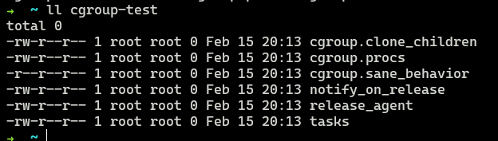

# 第二章 基础技术

# 第二章 基础技术

## Linux Namespace

可以隔离一系列系统资源，例如 PID、UID、Network。

- chroot 隔离文件:

  - [chroot 的用法](https://www.cnblogs.com/charlieroro/p/9259675.html)
  - 作用：改变进程的根目录，使它不能访问该目录之外的其他文件。即切换进程的 rootfs 常用命令 chroot
- 常见管理 namespace 的 API

  - clone()：传递特定的 flag(CLONE_NEW\*)标志给 clone()，则会根据每个标志创建对应新的 namespace 并且将子进程添加为其的成员。
  - setns()：允许一个进程加入一个已存在的 namespace 中。
  - unshare()：移出某个 Namespace，允许进程取消其执行的上下文，可以利用此系统调用让当前进程移动到一个新的 namespace 中。（unshare --pid: Unshare the pid namespace）
  - execv()：在子进程中运行一个新的程序

当前 Linux 一共实现了 6 种不同类型的 Namespace

|Namespace 类型|系统调用参数|
| -----------------| -------------|
|Mount Namespace|CLONE_NEWNS|
|UTS Namespace|CLONE_NEWUTS|
|IPC Namespace|CLONE_NEWIPC|
|PID Namespace|CLONE_NEWPID|
|Network Namespace|CLONE_NEWNET|
|User Namespace|CLONE_NEWUSER|

### UTS Namespace

用来隔离 hostname 和 domain name。在 UTS Namespace 里，每个 Namespace 允许有自己的 hostname。

### IPC Namespace

隔离进程间通信资源，即隔离 System V IPC 和 POSIX message queues。使用`ipcs -q`验证。

### PID Namespace

用来隔离进程 ID，`echo $$`显示当前 pid 为 1，但是不能用 ps 或 top 命令，因为这些命令使用/proc 里的内容。

### Mount Namespace

用于隔离各个进程看到的挂载点视图，不同 namespace 的进程中，看到的文件层次是不一样的。在 Mount Namespace 中，调用`mount()`和`umount()`仅仅会影响当前 namespace 内的文件系统，对全局的文件系统不会造成影响。

`mount` 和 `umount` 是 Linux 系统中用于挂载和卸载文件系统的命令。

#### mount 命令

`mount` 命令用于将文件系统挂载到指定的挂载点上，其基本语法为：

```
mount [options] <device> <mountpoint>
```

其中：

- `<device>`：表示要挂载的设备或文件系统的路径，可以是硬盘分区、软件 RAID 设备、CD-ROM 等。
- `<mountpoint>`：表示挂载的目标路径，也就是文件系统挂载的位置。

`mount` 命令的主要作用包括：

1. 将文件系统挂载到指定的挂载点上，使得文件系统中的内容可以被访问。
2. 可以通过不同的选项对挂载的行为进行配置，比如读写权限、文件系统类型等。

#### umount 命令

`umount` 命令用于卸载已经挂载的文件系统，其基本语法为：

```
umount <mountpoint>
```

其中：

- `<mountpoint>`：表示已经挂载的文件系统的挂载点。

`umount` 命令的主要作用是将指定挂载点上的文件系统卸载，使得该挂载点上的内容不再可见，并释放相关资源。

#### 使用示例

1. 挂载一个设备到指定挂载点：

   ```shell
   mount /dev/sdb1 /mnt
   ```

   这会将 `/dev/sdb1` 分区挂载到 `/mnt` 目录上。
2. 使用选项挂载一个文件系统：

   ```bash
   mount -t ext4 /dev/sdc1 /mnt
   ```

   这会将 `/dev/sdc1` 分区以 ext4 文件系统类型挂载到 `/mnt` 目录上。
3. 卸载一个已挂载的文件系统：

   ```bash
   umount /mnt
   ```

   这会将 `/mnt` 目录上的文件系统卸载。

这些命令对于管理 Linux 系统中的文件系统非常重要，能够方便地实现文件系统的挂载和卸载操作。

### User Namespace

主要用来隔离用户的用户组 ID，非 root 用户可以在自己创建的 User Namespace 里拥有 root 权限。使用`id`命令进行验证。

​​

### Network Namespace

用来隔离网络设备、IP 地址端口。使 Namespace 拥有独立的网络设备。运行`ifconfig`​没有任何网络设备。

​​

## Linux Cgroups

**Ubuntu 安装 cgroup**：`sudo apt install cgroup-tools`

全称 Control Group，对子系统提供精细化的控制能力，例如 cpu、内存、io、网络。

基于 cgroup virtual filesystem，这个系统文件一般挂载在 `/sys/fs/cgroup` 目录下。

通过将 pid 加入到对应`cgroup.procs`​，即可对进程所拥有的资源进行限制。

​​

cgroup 提供`cpu.cfs_quota_us`和`cpu.cfs_period_us`两个参数限制 CPU 占用的上限。

- `cpu.cfs_quota_us`: 运行周期，单位为微秒，默认 100,000us，即 100ms。
- `cpu.cfs_quota_us`: 运行周期内这个 cgroup 组所有进程可运行的时间总量，单位为微秒，默认值为-1，即不设置上限。

### cgroup 的三个组件：

1. **Subsystem（子系统）** ：
   子系统是 cgroups 的核心组件之一，用于控制和管理特定类型的资源。每个子系统负责监控和限制一种或多种资源，如 CPU、内存、磁盘 I/O、网络带宽等。不同的子系统对应不同的资源类型，例如，`cpu` 子系统用于限制 CPU 使用量，`memory` 子系统用于限制内存使用量，`blkio` 子系统用于限制磁盘 I/O 等。通过配置 cgroups 中的子系统，可以为进程组分配和限制资源的使用。
2. **Hierarchy（层级）** ：
   层级是 cgroups 中的一个概念，用于组织和管理 cgroups。一个 cgroups 层级可以包含多个 cgroups 组，并且可以为每个 cgroups 组分配一定数量的资源。每个 cgroups 层级由一个或多个子系统组成，这些子系统共同为 cgroups 中的进程组提供资源控制。层级可以以树状结构组织，每个层级都有一个顶层的根节点。
3. **Control Interface（控制接口）** ：
   控制接口是用户用于管理 cgroups 的接口，它允许用户创建、修改、删除 cgroups，并设置相应的资源限制和参数。通过控制接口，用户可以在运行时动态地管理 cgroups，实现对进程组资源的有效控制和管理。控制接口通常通过文件系统暴露，用户可以通过文件系统操作来管理 cgroups。常见的控制接口包括在 `/sys/fs/cgroup` 或 `/sys/fs/cgroup/<subsystem>` 下的文件和目录。

#### 三者之间的关系

- 系统创建新的 hierarchy，系统中所有的进程都会加入这个 hierarchy 的 cgroup 根节点，这个根节点由 hierarchy 默认创建。
- 一个 subsystem 只能附加在一个 hierarchy 上
- 一个 hierarchy 可以附加多个 subsystem
- 一个进程可以作为多个 cgroup 成员，但是这些 cgroup 必须在不同的 hierarchy 中
- 一个进程 fork 出子进程时，子进程与父进程在同一个 cgroup 里，也可以迁移到其他 cgroup 中

### Kernel 接口

1. 创建并挂载一个 hierarchy（cgroup 树）

   ```shell
   mkdir cgroup-test
   sudo mount -t cgroup -o none,name=cgroup-test cgroup-test ./cgroup-test
   ```

   ​​
2. 在根节点上扩展出两个子 cgroup

   ```shell
   cd cgroup-test
   sudo mkdir cgroup-1
   sudo mkdir cgroup-2
   ```

   ​​
3. 在 cgroup 中添加和移动进程

   ```shell
   echo $$
   cat /proc/$$/cgroup
   sudo sh -c "echo $$ > cgroup-1/tasks"
   cat /proc/$$/cgroup
   ```

   执行这段命令可以发现进程 76284 被加到了 cgroup-test:/cgroup-1 中

   ​​
4. 通过 subsystem 限制 cgroup 的资源

### Docker 如何使用 Cgroups？

docker 为每个容器创建 cgroup，并通过 cgroup 去配置资源限制和资源监控

## Union File System

Union File System，简称 UnionFS，是把其他文件系统联合到一个**联合挂载点**的文件系统服务。unionfs 用到了一个重要的资源管理技术，叫写时复制。

### AUFS

AUFS 重写了早期的 UnionFS1.x，改进了可靠性与性能。

#### image Layer与AUFS

##### **Image Layer（镜像层）** ：

Docker 镜像是由多个层组成的，每个镜像层都是一个只读的文件系统快照，包含了一组文件和目录。每个镜像层都有一个唯一的标识符，通常是基于其内容的哈希值。镜像层之间通过父子关系连接，使得 Docker 可以有效地共享和重用相同的文件系统层。当创建一个新的镜像时，Docker 会根据 Dockerfile 中的指令（比如 RUN、COPY、ADD 等）创建新的层，并在其上叠加已有的层，形成一个新的镜像。

##### image layer与AUFS是如何通过共享文件和文件夹实现镜像存储的？

Image Layer（镜像层）和 AUFS（Another Union File System）通过共享文件和文件夹的方式来实现镜像存储和管理的。

在 Docker 中，当创建一个新的镜像时，Docker 会根据 Dockerfile 中的指令逐步构建镜像，并生成一系列的镜像层。每个镜像层都包含了一组文件和目录的快照。这些文件和目录可以是通过 `RUN`​、`COPY`​、`ADD`​ 等指令添加到镜像中的。

AUFS 提供了一种联合挂载的技术，允许将多个只读的镜像层和一个可写的容器层组合在一起，形成一个完整的容器文件系统。AUFS 将这些不同的层叠加在一起，形成一个逻辑的文件系统视图。对于容器内的操作，AUFS 会根据层的优先级和可写性，选择相应的层来执行读取和写入操作。

在 AUFS 中，镜像层之间通过共享文件和文件夹来实现存储的。具体来说，AUFS 使用了一种称为写时复制（copy-on-write）的技术。当容器需要修改一个文件或目录时，AUFS 不会直接修改原始的文件或目录，而是创建一个副本并将修改写入副本中。这样做的好处是，多个容器可以共享相同的只读镜像层，而不会相互影响，从而节省存储空间和提高效率。

#### container layer与AUFS

##### **Container Layer（容器层）** ：

容器层是 Docker 容器的可写文件系统层，用于存储容器运行时产生的文件和目录，以及容器内部的变化。当您在容器中创建、修改或删除文件时，这些更改都会记录在容器层中。容器层使得 Docker 可以实现容器的状态隔离和持久化，即使容器被删除，容器层中的数据也可以被保留下来。
