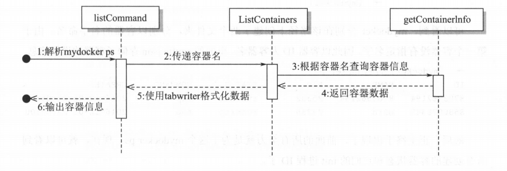

# 第五章 构建容器进阶

## 实现容器后台运行

在 Docker 早期版本，所有的容器 init 进程都是从 docker daemon 这个进程 fork出来的，这也就会导致一个众所周知的问题，如果 docker daemon 挂掉，那么所有的容器都会宕掉，这给升级 docker daemon 带来很大的风险。

后来，Docker 使用了 containerd， 也就是现在的runC，便可以实现即使 daemon挂掉，容器依然健在的功能了，其结构如下图所示。

​​

我们并不想去实现一个 daemon,因为这和容器的关联不是特别大，而且，查看Docker 的运行引擎 runC 可以发现，runC 也提供一.种 detach 功能，可以保证在runC 退出的情况下容器依然可以运行。因此，我们将会使用 detach 功能去实现创建完成容器后，mydocker 就会退出,但是容器依然继续运行的功能。

容器，在操作系统看来，其实就是一个进程。当前运行命令的 mydocker 是主进程，容器是被当前 mydocker 进程 fork 出来的子进程。子进程的结束和父进程的运行是一个异步的过程，即父进程永远不知道子进程到底什么时候结束。如果创建子进程的父进程退出，那么这个子进程就成了没人管的孩子，俗称孤儿进程。为了避免孤儿进程退出时无法释放所占用的资源而僵死，进程号为 1 的 init 进程就会接受这些孤儿进程。

**这就是父进程退出而容器进程依然运行的原理**。虽然容器刚开始是由当前运行的 mydocker 进程创建的，但是当 mydocker 进程退出后，容器进程就会被进程号为 1 的 init 进程接管，这时容器进程还是运行着的，这样就实现了 mydocker 退出、容器不宕掉的功能。

## 实现查看存在的容器

### 记录容器的info

​​

### ps命令执行流程

​​

## 实现查看容器的日志

一般来说，对于容器中运行的进程，使日志达到标准输出是一个非常好的实现方案，因此需要将容器中的标准输出保存下来，以便需要的时候访问。

我们就以此作为思路来实现 mydocker logs 命令。 我们会将容器进程的标准输出挂载到`/var/run/mydocker/容器名/container.log"`​文件中，这样就可以在调用 mydocker logs 的时候去读取这个文件，并将进程内的标准输出打印出来。

## 实现进入容器

### setns

加入对应的 Namespace 很简单，Linux提供了 [setns](https://man7.org/linux/man-pages/man2/setns.2.html) 系统调用给我们使用。

setns 是一个系统调用，可以根据提供的 PID 再次进入到指定的 Namespace中。它需要先打开`/proc/[pid/ns/`​文件夹下对应的文件，然后使当前进程进入到指定的 Namespace 中。

但是用 Go 来实现则存在一个致命问题：**setns 调用需要单线程上下文，而 GoRuntime 是多线程的**。

> 准确的说是 MountNamespace。

为了解决该问题，我们只能在 Go Runtime 启动之前，执行 setns 调用。

要实现这种提前调用，可以利用 cgo 的 constructor 技巧，该技巧能够在 Go Runtime 启动之前，执行一个任意的 C 函数。

> runC 中的 [nsenter ](https://github.com/opencontainers/runc/blob/v1.1.0/libcontainer/nsenter/nsenter.go)也是借助 cgo 实现的。

### Cgo

Cgo 是一个很炫酷的功能，允许 Go 程序去调用 C 的函数与标准库。你只需要以一种特殊的方式在 Go 的源代码里写出需要调用的 C 的代码，Cgo 就可以把你的 C 源码文件和 Go 文件整合成一个包。

下面举一个最简单的例子，在这个例子中有两个函数一Random 和 Seed,在 它们里面调用了 C 的 random 和 srandom 函数。

```go
package nsenter

/*
#include <errno.h>
#include <sched.h>
#include <stdio.h>
#include <stdlib.h>
#include <string.h>
#include <fcntl.h>

__attribute__((constructor)) void enter_namespace(void) {
   // 这里的代码会在Go运行时启动前执行，它会在单线程的C上下文中运行
	char *mydocker_pid;
	mydocker_pid = getenv("mydocker_pid");
	if (mydocker_pid) {
		// fprintf(stdout, "got mydocker_pid=%s\n", mydocker_pid);
	} else {
		// fprintf(stdout, "missing mydocker_pid env skip nsenter");
		// 如果没有指定PID就不需要继续执行，直接退出
		return;
	}
	char *mydocker_cmd;
	mydocker_cmd = getenv("mydocker_cmd");
	if (mydocker_cmd) {
		// fprintf(stdout, "got mydocker_cmd=%s\n", mydocker_cmd);
	} else {
		// fprintf(stdout, "missing mydocker_cmd env skip nsenter");
		// 如果没有指定命令也是直接退出
		return;
	}
	int i;
	char nspath[1024];
	// 需要进入的5种namespace
	char *namespaces[] = { "ipc", "uts", "net", "pid", "mnt" };

	for (i=0; i<5; i++) {
		// 拼接对应路径，类似于/proc/pid/ns/ipc这样
		sprintf(nspath, "/proc/%s/ns/%s", mydocker_pid, namespaces[i]);
		int fd = open(nspath, O_RDONLY);
		// 执行setns系统调用，进入对应namespace
		if (setns(fd, 0) == -1) {
			//fprintf(stderr, "setns on %s namespace failed: %s\n", namespaces[i], strerror(errno));
		} else {
			//fprintf(stdout, "setns on %s namespace succeeded\n", namespaces[i]);
		}
		close(fd);
	}
	// 在进入的Namespace中执行指定命令，然后退出
	int res = system(mydocker_cmd);
	exit(0);
	return;
}
*/
import "C"
```

这段代码导入了一个叫 C 的包，但是你会发现在 Go 标准库里面并没有这个包，那是因为这根本就不是一个真正的包，而只是 Cgo 创建的一个特殊命名空间，用来与 C 的命名空间交流。

可以看到，这段程序还是很怪异的，和普通的 Go 代码是不一样的。这里主要使用了构造函数，然后导入了 C 模块，一旦这个包被引用，它就会在所有 Go 运行的环境启动之前执行，这样就避免了 Go 多线程导致的无法进入 mnt Namespace 的问题。这段程序执行完毕后，Go 程序才会执行。

但是这会带来一个问题，就是只要这个包被导入，它就会在所有 Go 代码前执行，那么即使那些不需要使用 exec 这段代码的地方也会运行这段程序。

举例来说，使用 mydocker run 来创建容器，但是这段 C 代码依然会执行，这就会影响前面已经完成的功能。因此，在这段 C 代码前面一开始的位置就添加了环境变量检测，没有对应的环境变量时，就直接退出。对于不使用 exec 功能的 Go 代码，只要不设置对应的环境变量，这段 C 代码就不会运行，这样就不会影响原来的逻辑。

**注意：只有在你的 Go 应用程序中注册、导入了这个包，才会调用这个构造函数**。 就像这样：

```go
import (
	_ "mydocker/nsenter"
)
```

使用 cgo 我们无法直接获取传递给程序的参数，可用的做法是，通过 go exec 创建一个自身运行进程，然后通过传递环境变量的方式，传递给 cgo 参数值。

体现在 runc 中就是 `runc create → runc init`​ ，runc 中有很多细节，他通过环境变量传递 netlink fd，然后进行通信。

## 实现停止容器

主要就是查找到它的主进程 PID,然后发送 SIGTERM 信号，等待进程结束就好。

## 实现删除容器

主要是文件操作，因为容器对应的进程已经被停止，所以只需要将对应记录文件信息的目录删除即可。

## 实现根据容器构造镜像

之前容器都是用的 /root/merged 目录作为自己的 rootfs，当启动多个容器时可写层会互相影响。

所以，本节要实现如下两个目的。

* 1）为每个容器分配单独的隔离文件系统。
* 2）修改 mydocker commit 命令，实现对不同容器进行打包镜像的功能。
* 3）修改 mydocker rm 命令，删除容器时顺带删除文件系统

### 实现隔离文件系统

改动点：

* 1）runCommand 命令中添加 imageName 作为第一个参数输入

  * 相关方法都要增加相关参数
  * containerInfo 增加对应字段
* 2）rootfs 相关目录定义成变量，不在固定写死。
* 3）文件系统相关操作抽取出来，单独放到 volume.go 文件中

## 实现指定环境变量运行

exec 命令其实是 mydocker 发起 的另外一个进程，这个进程的父进程其实是宿主机的，并不是容器内的。因为在Cgo里面使用了 setns 系统调用，才使得这个进程进入到了容器内的命名空间，但是由于环境变量是继承自父进程的，因此**这个 exec 进程的环境变量其实是继承自宿主机的，所以在 exec 进程内看到的环境变量其实是宿主机的环境变量**。

但是，只要是容器内 PID 为 1 的进程，创建出来的进程都会继承它的环境变量。下面修改 exec 命令来直接使用 env 命令查看容器内环境变量的功能。

## 小结

本章实现了容器操作的基本功能。

* 首先实现了容器的后台运行，然后将容器的状态在文件系统上做了存储。
* 通过这些存储信息，又可以实现列出当前容器信息的功能。
* 并且， 基于后台运行的容器，我们可以去手动停止容器，并清除掉容器的存储信息。
* 最后修改了上一章镜像的存储结构，使得多个容器可以并存，且存储的内容互不干扰。

‍

‍
