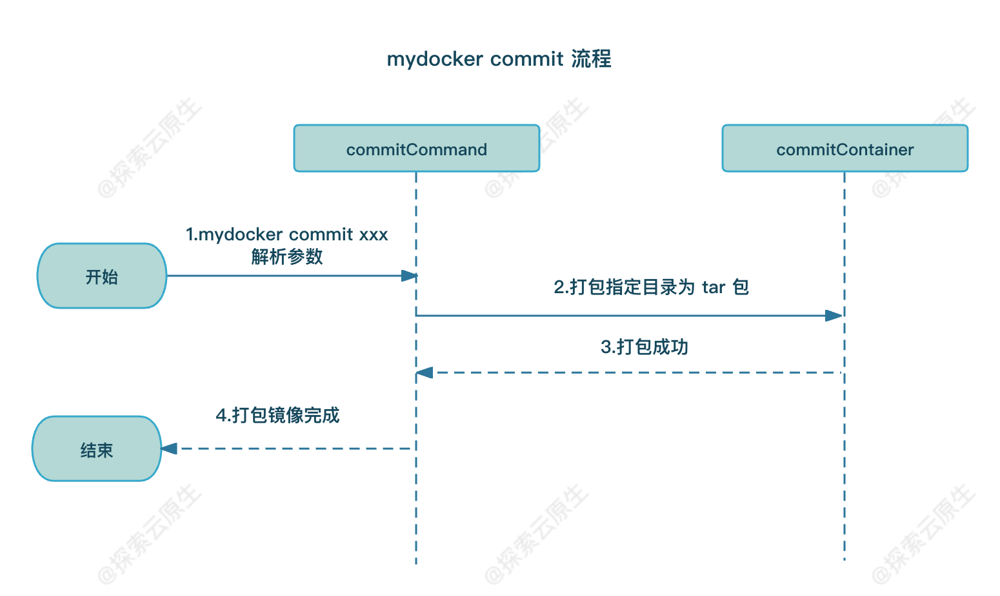

# 第四章 构造镜像

## 使用busybox创建容器

* 准备 rootfs：将运行中的 busybox 容器导出并解压后作为 rootfs
* 挂载 rootfs：使用`pivotRoot`​ 系统调用，将前面准备好的目录作为容器的 rootfs 使用

在切换 rootfs 之后，容器就实现了和宿主机的文件系统隔离。

### 实现原理

**使用**​**`pivot_root`**​ **系统调用来切换整个系统的 rootfs**，配合上 `/root/busybox`​ 来实现一个类似镜像的功能。

​**`pivot_root`**​ **是一个系统调用，主要功能是去改变当前的 root 文件系统**。

原型如下：

```c
#include <unistd.h>

int pivot_root(const char *new_root, const char *put_old);
```

* ​`new_root`​：新的根文件系统的路径。
* ​`put_old`​：将原根文件系统移到的目录。

使用 `pivot_root`​ 系统调用后，原先的根文件系统会被移到 `put_old`​ 指定的目录，而新的根文件系统会变为 `new_root`​ 指定的目录。这样，当前进程就可以在新的根文件系统中执行操作。

> 注意：new_root 和 put_old 不能同时存在当前 root 的同一个文件系统中。

**pivotroot 和 chroot 有什么区别？**

* pivot_root 是把整个系统切换到一个新的 root 目录，会移除对之前 root 文件系统的依赖，这样你就能够 umount 原先的 root 文件系统。
* 而 chroot 是针对某个进程，系统的其他部分依旧运行于老的 root 目录中。

## 基于overlayfs实现写操作隔离

https://www.lixueduan.com/posts/docker/09-ufs-overlayfs/

overlayfs 一般分为 lower、upper、merged 和 work 4个目录。

* lower 只读层，该层数据不会被修改
* upper 可读写层，**所有修改都发生在这一层，即使是修改的 lower 中的数据**。
* merged 视图层，可以看到 lower、upper 中的所有内容
* work 则是 overlayfs 内部使用

使用我们的镜像目录(busybox 目录) 作为 lower 目录，这样可以保证镜像内容被修改。

merged 目录由于可以看到全部内容，因此作为容器 rootfs 目录，即 pivotRoot 会切换到 merged 目录。

upper 目录则是用于保存容器中的修改，因为 overlayfs 中所有修改都会发生在这里。

overlayfs 引入具体流程如下：

* 1）自动解压 busybox.tar 到 busybox 作为 lower 目录，类似 docker 镜像层
* 2）容器启动前准备好 lower、upper、work、merged 目录并 mount 到 merged 目录
* 3）容器启动后使用 pivotRoot 将 rootfs 切换到 merged 目录

  * 后续容器中的修改由于 overlayfs 的特性，都会发生在 upper 目录中，而不会影响到 lower 目录
* 4）容器停止后 umount 并移除upper、work、merged 目录

## 实现volume数据卷挂载(持久化数据)

​`bind mount`​ 是一种将一个目录或者文件系统挂载到另一个目录的技术。它允许你在文件系统层级中的不同位置共享相同的内容，而无需复制文件。

​`mount -o bind /host/directory/ /container/directory/`​这样容器中往该目录里写的数据最终会共享到宿主机上，从而实现持久化。

**首先要理解 linux 中的 bind mount 功能**。

​`bind mount`​ 是一种将一个目录或者文件系统挂载到另一个目录的技术。它允许你在文件系统层级中的不同位置共享相同的内容，而无需复制文件。

**其次，则是要理解宿主机目录和容器目录之间的关联关系**。

以 `-v /root/volume:/tmp`​ 参数为例：

* 1）按照语法，`-v /root/volume:/tmp`​ 就是将宿主机`/root/volume`​ 挂载到容器中的 `/tmp`​ 目录。
* 2）由于前面使用了 pivotRoot 将 `/root/merged`​ 目录作为容器的 rootfs，因此，容器中的根目录实际上就是宿主机上的 `/root/merged`​ 目录
* 3）那么容器中的 `/tmp`​目录就是宿主机上的 `/root/merged/tmp`​ 目录。
* 4）因此，我们只需要将宿主机`/root/volume`​ 目录挂载到宿主机的 `/root/merged/tmp`​ 目录即可实现 volume 挂载。

## 实现commit打包容器为镜像

由于之前使用 pivotRoot + overlayfs 技术 将 `/root/merged`​ 目录作为容器的 rootfs，因此容器中的所有改动都发生在该目录下。

**这里我们的** **`mydocker commit`**​ **命令只需要把该目录保存下来即可，因此简单实现为 使用 tar 命令将**​ **`/root/merged`**​ **目录打成 tar 包**

​​

## 推荐阅读:

https://www.lixueduan.com/posts/docker/mydocker/04-change-rootfs-by-pivot-root

https://www.lixueduan.com/posts/docker/mydocker/05-isolate-operate-by-overlayfs

https://www.lixueduan.com/posts/docker/mydocker/06-volume-by-bind-mount

https://www.lixueduan.com/posts/docker/mydocker/07-mydocker-commit

‍
